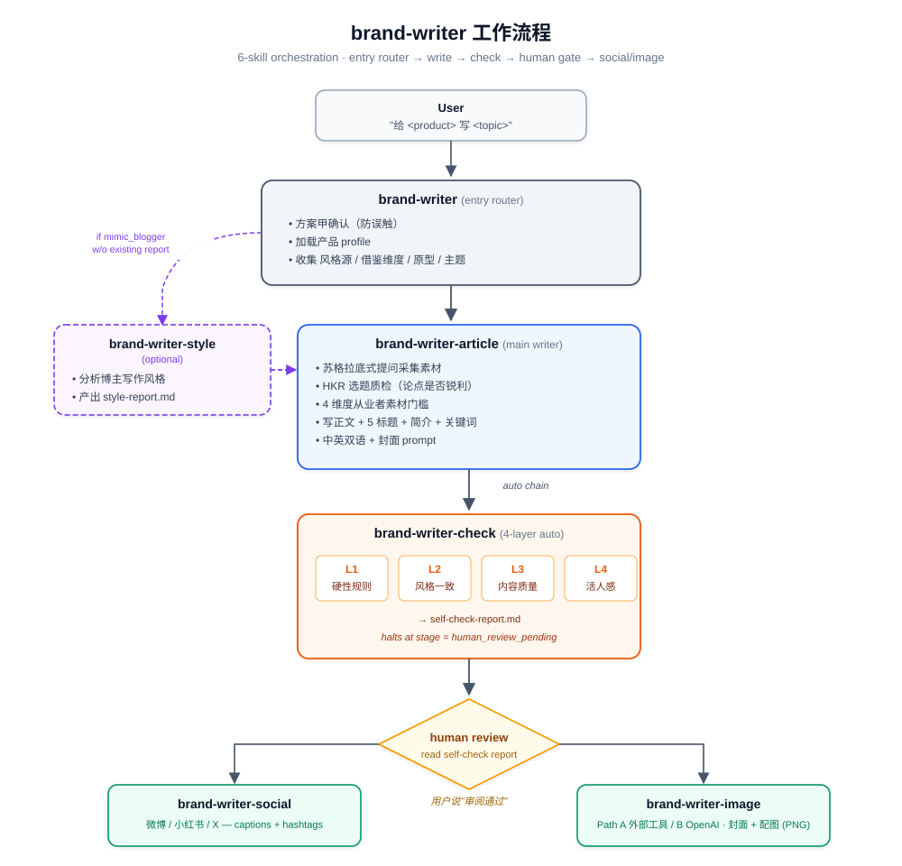

# brand-writer

> Claude Code plugin for branded content writing — articles, style mimicry, social captions, covers, self-check.
> 一套面向品牌号的 AI 写稿工作流：写文章 / 模仿博主风格 / 社媒文案 / 配图 / 自检。

---

## 它能做什么

- 用产品自己的"品牌调性"或模仿任意博主风格写文章
- 写完自动跑 4 层自检（硬性规则 / 风格一致 / 内容质量 / 活人感）
- 一键产出社媒短文案 + 封面图（fal.ai）
- 中断恢复、人工审阅 gate、可扩展产品库

## 适合谁

- 品牌方 / 独立运营人，要持续输出多产品多平台内容
- 有内容投放场景但没专职文案
- 已经在用 Claude Code 的开发者 / 创作者

## 不适合谁

- 个人公众号 / 博客（更适合自己手写）
- 一次性内容生成（开个 chat 直接问就行）

---

## 完整工作流

<p align="center">
  
</p>

**流程要点**：
- `brand-writer` 入口先做方案甲确认，再收集风格源 / 借鉴维度 / 原型 / 主题
- `brand-writer-style` 仅在选「模仿博主」且无现成风格报告时被路由触发
- `brand-writer-article` 写完正文自动 chain 到 `brand-writer-check`，跑完 4 层自检停在 `human_review_pending`
- 你审阅 `self-check-report.md` 后说"审阅通过"，才解锁下游的 `social` 和 `image`
- 任意一步中断后可用「继续写 `<标题>`」从 `_session.json` 恢复

## 安装

```bash
# 1. 装插件
/plugin install brand-writer

# 2. （可选）自定义工作目录
export BRAND_WRITER_HOME="$HOME/my-content"

# 3. （可选）配置配图 API
export FAL_API_KEY="fal_xxxxxxxxxxxx"
```

详细安装与排错见 `skills/brand-writer/references/setup.md`。

---

## 快速开始（约 10 分钟）

### Step 1：建你自己的产品 profile

复制示例文件起步：

```bash
cp ~/.claude/plugins/brand-writer/skills/brand-writer/profiles/example-product.md \
   ~/.claude/plugins/brand-writer/skills/brand-writer/profiles/your-product.md
```

打开 `your-product.md`，按 schema 改写每个 section（产品定位 / 目标用户 / 核心场景 / 痛点库 / 技术关键词 / 品牌规则 / 联系方式 / 写作偏好）。完整字段说明在 `references/product-profile-schema.md`。

**关键字段**：

| 字段 | 作用 |
|---|---|
| `name` | 英文短名（小写、连字符），Skill 内部 key |
| `display_name_zh` / `display_name_en` | 文章中出现的产品正式名 |
| 核心痛点库 | AI 写作时直接引用的痛点池，越具体越好 |
| 品牌规则 | 人称 / 禁用自称 / 自创术语等约束 |
| 联系方式 | 故障排查类文章结尾会引用客服邮箱 |
| 写作偏好 | 标题风格 / 开篇规则 / 类比原则等品牌调性 |

### Step 2：在 Claude Code 中触发写作

打开 Claude Code，发：

> 给 your-product 写一篇「为什么 VPN 开着 AI 反而用不了」的故障排查文

工作流会一步步问你：

1. **方案甲确认** — "确认给 your-product 写一篇稿子？"（防误触）
2. **风格源** — 三选一：
   - `official` — 用 profile 里的官方调性写
   - `mimic_blogger` — 模仿某博主写（需要风格报告，没有时会先跑 brand-writer-style 生成）
   - `free` — 自由写
3. **借鉴维度（可选）** — 即使主风格选 official，也可以借鉴某博主的某些维度（标题/开篇/节奏/结尾/互动）
4. **文章原型** — 7 选 1：
   - `trouble_shoot` 故障排查 — 用户已中招找解法
   - `pitfall` 排雷避坑 — 用户没中招，预警高危
   - `science` 产品科普 — 解释机制原理
   - `investigation` 调查实验 — 带预设假设动手验证
   - `experience` 产品体验 — 沉浸式带读者玩
   - `phenomenon` 现象解读 — 观察行业现象层层拆
   - `free` 自由 — 公告/致歉/对比等不套模板
5. **主题** — 自由文本

### Step 3：观察 brand-writer-article 的提问

主写作 skill 会用苏格拉底式问法收集素材：

- HKR 选题质检（论点是否足够锐利）
- 4 维度从业者素材（用户本人 / 同事观察 / 客服反馈 / 行业内幕）
- 原型门槛检查（不同原型对素材深度要求不同）

不够锐就追问，不够具体就要细节。**素材是品牌号文章立得住的根基**——不要随便糊弄。

### Step 4：自动跑自检

正文写完后自动 chain 到 brand-writer-check，跑 4 层：

| 层 | 检什么 |
|---|---|
| L1 硬性规则 | 禁用词（按风格源切档位）、客服邮箱合规、配图标注格式 |
| L2 风格一致 | 是否符合 profile 写作偏好和所选风格源 |
| L3 内容质量 | 论点锐利度、素材具体度、类比是否堆叠 |
| L4 活人感 | 第一人称真实性、AI 凭空想象段落识别 |

输出独立的 `self-check-report.md`，停在 `human_review_pending`，等你审阅。

### Step 5：审阅 → 触发下游

打开 `self-check-report.md`，自己再过一遍。觉得 OK 就回会话里说：

> 审阅通过

之后按需触发：

- `生成微博文案` / `给这篇写小红书 caption` → brand-writer-social
- `生成配图` / `画一下封面` → brand-writer-image（需要 FAL_API_KEY）

---

## 6 个 skill 详解

| skill | 触发方式 | 产出 |
|---|---|---|
| `brand-writer` | "给 <产品> 写..." / "继续写 <标题>"（恢复中断稿） | 路由到下游，不直接产出 |
| `brand-writer-article` | 由 brand-writer 路由 / "开始创作"（已确认产品） | `articles/<标题>/<标题>.md` 含正文+标题候选+简介+关键词+封面 prompt（中英双语） |
| `brand-writer-style` | "分析 <博主> 风格" | `style-reports/<platform>/<博主>.md` 风格报告 |
| `brand-writer-check` | 自动 chain / "跑下自检" | `self-check-report.md`（与正文同目录） |
| `brand-writer-social` | "审阅通过"后 / "给这篇写微博文案" | 追加到正文 .md 的「社媒文案」section |
| `brand-writer-image` | "审阅通过"后 / "生成配图" | `articles/<标题>/images/cover.png + img1.png ...` |

每个 skill 也可以独立触发（不必走入口路由），适合"已经写好了，单独再跑某一步"的场景。

---

## 目录结构

工作目录在 `$BRAND_WRITER_HOME`（默认 `~/Documents/brand-writer/`）：

```
$BRAND_WRITER_HOME/
├── articles/
│   └── <文章标题>/
│       ├── <文章标题>.md              # 正文 + 英文版 + 社媒文案
│       ├── self-check-report.md       # 4 层自检报告（独立文件）
│       ├── _session.json              # 会话恢复状态机
│       └── images/
│           ├── cover.png
│           └── img1.png ... imgN.png
├── style-reports/
│   ├── wechat/<博主名>.md             # 公众号博主风格
│   ├── xhs/<博主名>.md                # 小红书博主风格
│   └── x/<博主名>.md                  # X / Twitter
└── _design/                           # 给设计师的视觉简报（可选）
```

产品 profile **不放在工作目录**，而是在 plugin 目录里：
`~/.claude/plugins/brand-writer/skills/brand-writer/profiles/`

profile 是 plugin 配置，不是用户产出物——这样跨机器跟着 plugin 走。

---

## 中断恢复

每篇文章有个 `_session.json` 记录当前 stage：

| stage | 含义 |
|---|---|
| `drafting` | 正在写正文 |
| `self_check` | 正文落稿，自检中 |
| `human_review_pending` | 自检过关，等你审阅 |
| `idle` | 已审阅，等下一步指派 |
| `social_gen` / `image_gen` | 正在生成社媒/配图（中断恢复标记） |
| `done` | 全流程完成 |

如果中途网络断了或退出会话，回来时直接说：

> 继续写 <标题>

会读 session、跳到对应 stage 接着干。

---

## Obsidian 用户

把工作目录指到 vault 即可获得 wiki-link / Dataview / Canvas 联动：

```bash
export BRAND_WRITER_HOME="$HOME/Obsidian/MyVault/AI Writer"
```

详见 [`docs/obsidian-mode.md`](./docs/obsidian-mode.md)，含 Dataview 查询示例（按月聚合 / 按产品过滤）。

---

## 故障排查

| 症状 | 原因 | 解决 |
|---|---|---|
| 触发了但没进 brand-writer | 消息里没有产品名/写作动词组合 | 显式说"给 <profile name> 写..." |
| 提示"profile 不存在" | profile 文件名和你说的产品名对不上 | 检查 `profiles/` 下文件名（小写、连字符） |
| brand-writer-image 报"FAL_API_KEY 未设置" | env 未配 | 见安装 Step 3，配完重启 shell |
| 配图生成失败 | API 网络/额度问题 | 看 fal.ai dashboard，或先跳过配图发文 |
| 自检卡住不通过 | 内容确实不达标 | 按 self-check-report.md 的具体提示返工 |
| 想模仿的博主没有报告 | 风格报告未生成 | 选 mimic_blogger 时会自动 chain 到 brand-writer-style 先采集 |

---

## 配置参考

- Profile schema：`skills/brand-writer/references/product-profile-schema.md`
- 共享常量与枚举：`skills/brand-writer/references/constants.md`
- 工作流关系图：`skills/brand-writer/references/workflow-diagram.md`
- 安装与排错：`skills/brand-writer/references/setup.md`
- 文章原型详解：`skills/brand-writer-article/references/article-archetypes.md`
- 品牌通用规则：`skills/brand-writer-article/references/brand-voice-rules.md`
- 自检禁用词表：`skills/brand-writer-check/references/banned-words.md`
- 配图风格选项：`skills/brand-writer-image/references/style-options.md`

---

## License

MIT — see [LICENSE](./LICENSE).

---

## English

`brand-writer` is a Claude Code plugin that turns product briefs into ready-to-publish branded articles. It writes in your product's brand voice (or mimics a target blogger), runs a 4-layer quality check, and optionally generates cover/inline images via fal.ai.

### Install

```bash
/plugin install brand-writer
export BRAND_WRITER_HOME="$HOME/my-content"     # optional, defaults to ~/Documents/brand-writer/
export FAL_API_KEY="fal_xxx"                    # optional, for image generation
```

### How it works

The plugin is a 6-skill workflow:

1. **brand-writer** — entry router. Confirms the product, loads its profile, asks for style source / archetype / topic.
2. **brand-writer-style** — analyzes a target blogger's style and saves a report. Triggered when you choose "mimic blogger" but no report exists yet.
3. **brand-writer-article** — main writer. Uses Socratic questioning to collect first-hand source material before drafting. Outputs an article folder with text + 5 title candidates + summary + keywords + cover prompt (bilingual).
4. **brand-writer-check** — runs 4 self-check layers (hard rules / style consistency / content quality / human-feel), produces a separate `self-check-report.md`, then halts at `human_review_pending`.
5. **brand-writer-social** — after you approve, generates social captions + hashtags for WeChat / Xiaohongshu / X.
6. **brand-writer-image** — after you approve, generates cover and inline images via fal.ai.

### Quick start

1. Create a product profile by copying the scaffold:

   ```bash
   cp ~/.claude/plugins/brand-writer/skills/brand-writer/profiles/example-product.md \
      ~/.claude/plugins/brand-writer/skills/brand-writer/profiles/your-product.md
   ```

   Edit each section per `references/product-profile-schema.md`.

2. In Claude Code:

   > write an article for your-product about <topic>

3. Walk through: confirm → pick style source (`official` / `mimic_blogger` / `free`) → optional borrowed dimensions → pick archetype (7 types: trouble-shoot, pitfall, science, investigation, experience, phenomenon, free) → topic.

4. The article lands at `$BRAND_WRITER_HOME/articles/<title>/`. Read `self-check-report.md`, then say "审阅通过" (approve) to unlock social-caption and image-generation steps.

### Article archetypes — when to pick which

| Archetype | When the user is... |
|---|---|
| `trouble_shoot` | already hit a problem and looking for a fix |
| `pitfall` | not yet hit, but about to make a known mistake |
| `science` | curious about how something works |
| `investigation` | (you, the brand) testing a hypothesis hands-on |
| `experience` | (you, the brand) trying out a product immersively |
| `phenomenon` | (you, the brand) interpreting an industry trend |
| `free` | announcement / apology / comparison / brand statement |

### Configuration reference

See `skills/brand-writer/references/` for the full schema, constants, and workflow diagram.

### License

MIT.
